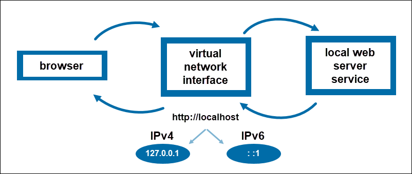

# 127.0.0.1

The IP address `127.0.0.1`, also referred to as `localhost`, is a special address that refers to the computer you're currently using. This loopback address allows your computer to communicate with itself, meaning any data sent to this address doesn't go out to the internet, but instead gets looped back to the same machine.

Computers use IP addresses to communicate with each other. Normally, these addresses identify a device on a network. However, the localhost `127.0.0.1` is a reserved address that tells the computer to route network traffic back to itself, allowing applications and services to communicate with each other on the same device without the need for an external network connection.

The entire range of IP addresses from `127.0.0.0` to `127.255.255.255` is reserved for loopback purposes. However, `127.0.0.1` is the standard address used for loopback communication.

This is useful for various purposes:

- **Communication with Local Services:** Allowing applications to access services running locally without needing an external network connection.
- **Testing and Development:** Testing web servers running on your machine by accessing them through a web browser at `http://localhost`.
- **Isolation and Security:** Since localhost traffic doesn't leave your computer, it is isolated from external networks. This makes it a secure environment for testing and running local services without exposing them to potential security risks on the internet.

## Examples

- **Testing a Web Server:** Imagine you're developing a website on your computer, and you want to test how it looks and functions in a web browser. You can run a local web server on your machine, and when you navigate to `http://localhost` in your browser, you're actually accessing your own computer. The web server serves the website files to your browser, allowing you to preview and debug your website before deploying it to the internet.

- **Running a Local Database:** Suppose you're building a software application that interacts with a database. During development, you want to test how your application communicates with the database without affecting the actual database server. You can set up a local database server on your computer, and your application can connect to it using `127.0.0.1` or localhost as the server address. This way, you can safely test database queries and operations without risking data corruption or network disruptions.

In essence, `localhost` is a way for applications on your device to talk to other applications or services running on the same device.

## References

[What Is 127.0.0.1 Localhost?](https://phoenixnap.com/kb/127-0-0-1-localhost)

[What Is the 127.0.0.1 IP Address?](https://www.lifewire.com/network-computer-special-ip-address-818385#toc-127001-vs-other-special-ip-addresses)

[What is Localhost? Local Host IP Address Explained](https://www.freecodecamp.org/news/what-is-localhost/)