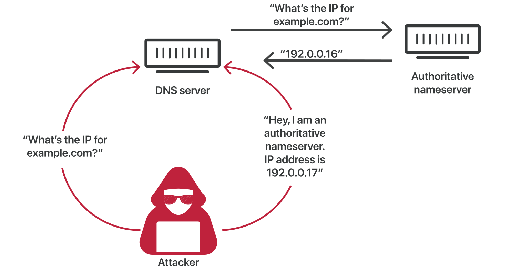

# What is DNS?

The Domain Name System (DNS) is the phonebook of the Internet. Humans access information online through domain names, like youtube.com. Web browsers interact through Internet Protocol (IP) addresses. DNS translates domain names to IP addresses so browsers can load Internet resources.

Each device connected to the Internet has a unique IP address which other machines use to find the device. DNS servers eliminate the need for humans to memorize IP addresses such as `192.168.1.1` (in IPv4), or more complex newer alphanumeric IP addresses such as `2400:cb00:2048:1::c629:d7a2` (in IPv6).

In short, DNS acts like a giant phonebook for the internet. Instead of memorizing complex numerical addresses (like `172.217.160.133`), we use easy-to-remember domain names (like google.com). DNS translates human-readable domain names into machine-readable IP addresses that computers use to connect to each other.

You type "amazon.com" in your browser. The DNS looks up "amazon.com" and finds its corresponding IP address (e.g., `52.208.135.231`), then your browser uses this IP address to connect to the Amazon website and display it for you.

## How Does DNS Route Traffic To Your Web Application?

This diagram is an overview of how recursive and authoritative DNS services work together to route an end user to your website or application.

<figure>
  
  <figcaption>Amazon Route 53 Traffic Routing</figcaption>
</figure>

## A Cyber Security Warning

Hackers have sometimes taken advantage of lax oversight and used DNS maliciously. One example of that is DNS cache poisoning, in which false data is fed into the DNS cache that directs people to malicious websites hosting data-swiping malware.

<figure>
  
  <figcaption>How DNS cache poisoning happens</figcaption>
</figure>

Cyberattackers can also use DNS as a way to get data packets with malicious software into a system, a type of attack called DNS tunneling. This attack hides bad software behind seemingly innocent DNS traffic and is often used to establish a command and control connection with a target network. Bad DNS cache data will often remain on the server, directing new queries until it expires or gets removed manually, meaning a lot of people can be misdirected if DNS traffic isn’t regularly monitored. 

## References

[What is DNS?](https://www.cloudflare.com/en-gb/learning/dns/what-is-dns/)

[What is DNS?](https://aws.amazon.com/route53/what-is-dns/)

[What Is DNS?](https://www.pcmag.com/how-to/what-is-dns-how-it-works-domain-name-system)